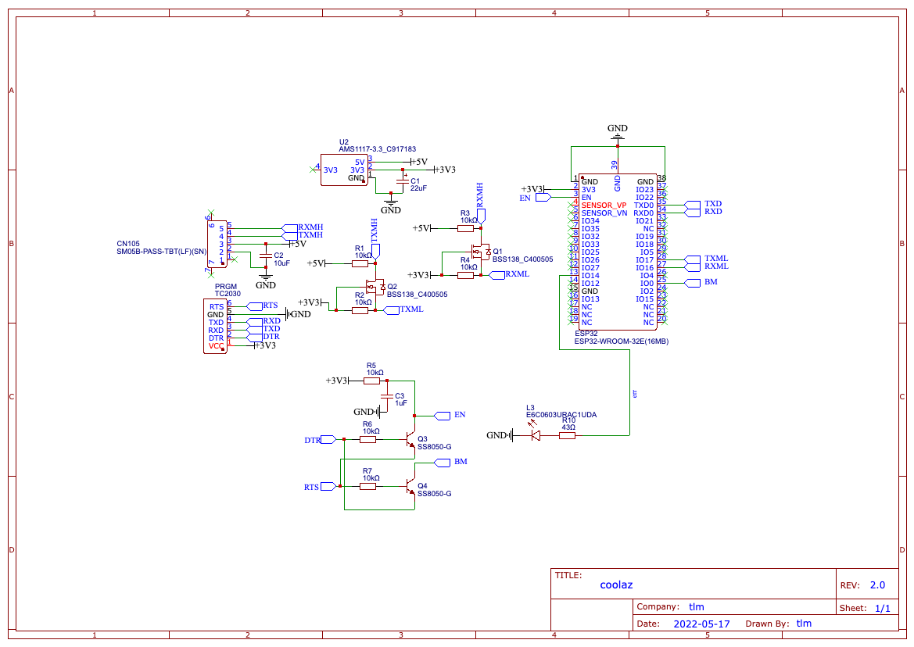

# coolaz-board
coolaz board is a pcb containing an esp32 and the all the associated components
to connect and live inside of a Mitsubishi Heat Pump. The boards primary design
is to work with [Home Assistant](https://www.home-assistant.io/) allowing for
the automation of it's connected heat pump.

# Caution
Use this board at your own risk. I am by no means a professional electrical
engineer and take no responsibility for any damage it may cause.

# Design
The board and associated semantics have been designed using
[easyeda](https://easyeda.com/) and exported to this repository for
documentation and backup purposes. As of writing I am also using the parent
company of easyeda ([JLPCB](https://jlcpcb.com/)) to aslo print and assemble the
circuit boards.

# Schematic

# License
Licensed under MIT

# Thank you
Without the hard work of people before me this board would not be possible.

Thank you:

- [SwiCago](https://github.com/SwiCago/HeatPump)
- [Chris Davis](https://chrdavis.github.io/hacking-a-mitsubishi-heat-pump-Part-1/)

# Contributions
Welcome, please reach out or create an issue if you would like to help improve
the design.